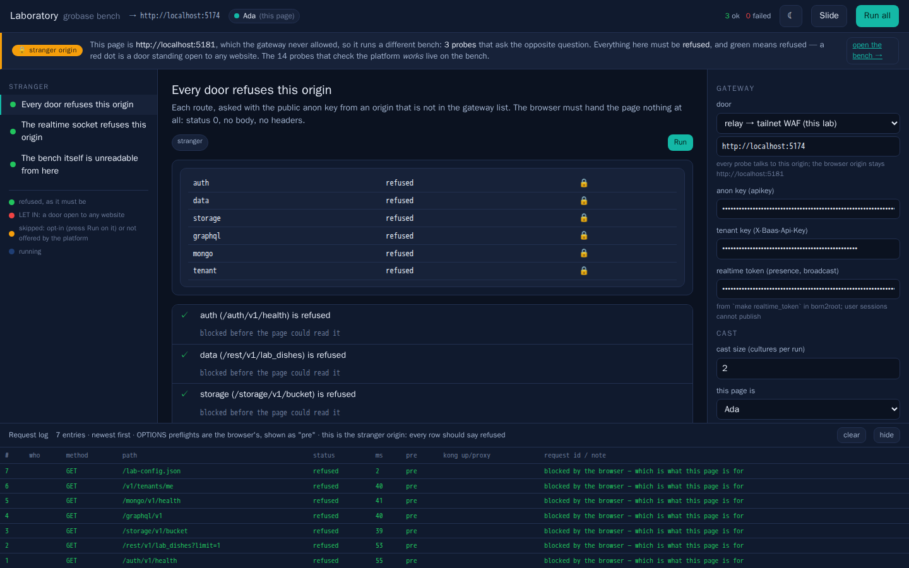
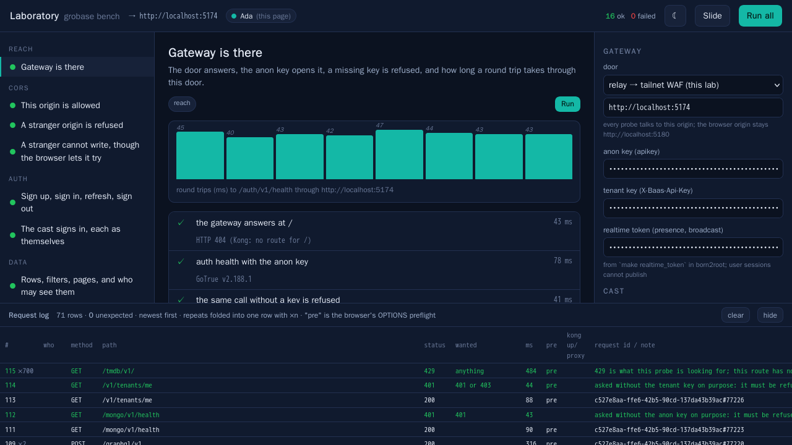
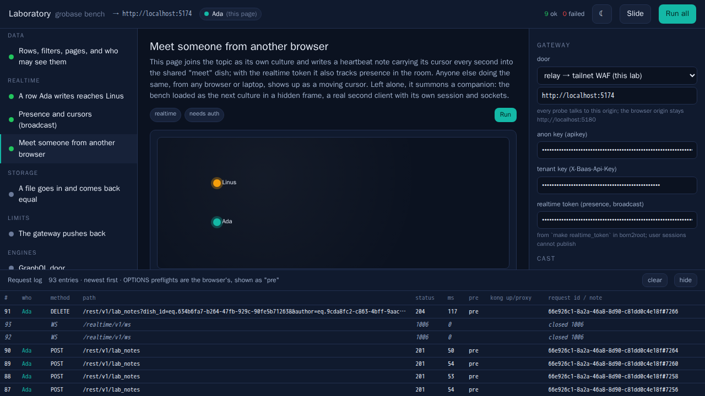
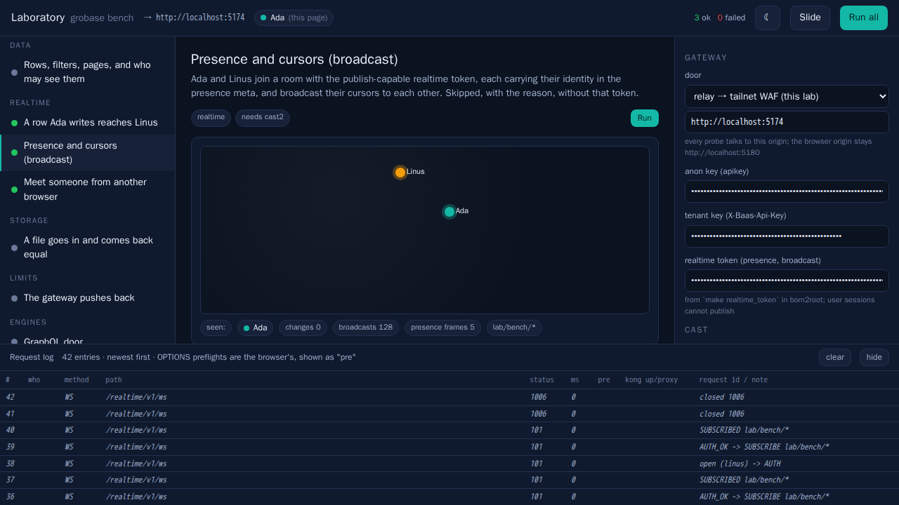
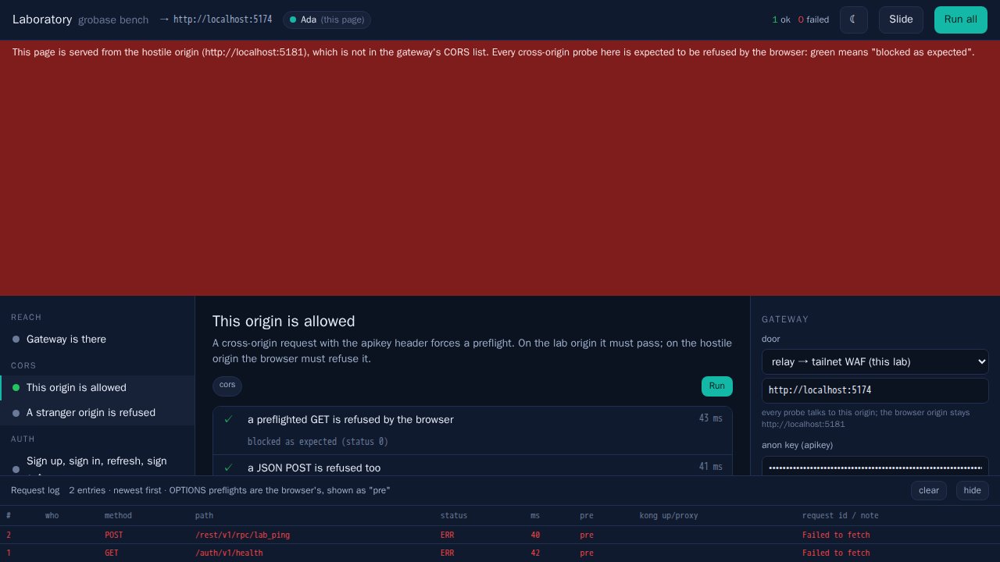
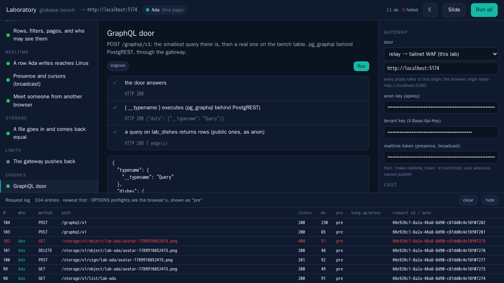

# Laboratory

A living test bench for the datacenter: a space where a program, low-level
or high-level, is exercised against the real platform from a real browser,
by several people at once, with every request visible. Docker is the only
dependency. The first bench is **grobase**, the BaaS running in the `baas`
VM built by born2root.

Think Storybook, turned toward a backend: instead of components in
isolation you get **probes** (one check each, rendered live), **cultures**
(personas with independent sessions: Ada, Linus, Grace, Margaret) and
**dishes** (scenarios that put several cultures in one probe). The same
registry powers the UI and the Playwright suite, so what you click is
exactly what CI asserts. A run exports as a **Slide** (Markdown + JSON).

## Quick start

```sh
cp .env.example .env && chmod 600 .env    # TS_AUTHKEY, WAF_HOST, GROBASE_ANON_KEY, GROBASE_REALTIME_TOKEN
make up                                   # joins the tailnet, pins the WAF cert, serves the bench
open http://localhost:5180                # the bench · http://localhost:5181 is the hostile origin
make e2e                                  # Playwright in Docker: report/playwright/index.html, shots, videos
```

The bench schema is applied once by the VM owner (the gateway offers no
schema door in the `pro` tier):

```sh
make -C /goinfre/dlesieur/born2root sql FILE=$PWD/schema/001_grobase_bench.sql B2B_CONFIG=profiles/server.toml
```

## How it reaches the platform

```
browser  ──http://localhost:5180──►  lab (nginx, static)
   │
   └─fetch/WS──http://localhost:5174──►  relay (nginx) ─┐  same network namespace
                                          tailscale ────┘  a real tailnet device (kernel tun,
                                               │           rootless Docker)
                                               ▼  WireGuard
                                   https://<node>.ts.net:8443  WAF → Kong → grobase
```

The lab is a second device on the tailnet, subject to the same ACL a
teammate's laptop is. The browser origin (5180) and the API origin (5174)
differ on purpose: CORS is exercised for real, and the relay passes
`Origin` through untouched. The hostile origin (5181) serves the same app
from a port that is deliberately **not** in the gateway's list; its probes
are green when the browser refuses them.

The gateway is a knob: presets for the relay, the host SSH tunnel
(`make baas_access` in born2root, `http://127.0.0.1:18000`), the public
Funnel URL and the tailnet directly.

## Probes

| group | probe | what must hold |
| --- | --- | --- |
| Reach | Gateway is there | `/` answers, `/auth/v1/health` with the anon key, refused without it, REST OpenAPI, latency samples, Kong's exposed headers |
| CORS | This origin is allowed | preflighted GET and JSON POST pass, and Kong's exposed headers reach the page |
| CORS | A stranger origin is refused | the hostile page, in an iframe, reports what the browser let it see: nothing |
| Auth | Sign up, sign in, refresh, sign out | the session life, plus the answers that must be "no": wrong password, tampered token, refresh after sign-out; `rpc lab_ping` sees the same uid |
| Auth | The cast signs in | each culture holds its own session, distinct ids |
| Data | Rows, filters, pages, and who may see them | CRUD, `select`/`order`, `Range` paging, RPC, and RLS: Linus sees nothing private, everything public, cannot write or delete Ada's rows; anonymous reads public only |
| Realtime | A row Ada writes reaches Linus | two sockets on `pg/lab_notes/*`: inserted, updated (old and new row), deleted by cascade, in order |
| Realtime | Presence and cursors (broadcast) | two cultures join a `lab/bench/*` room with the publish-capable realtime token, each in the presence meta; cursors cross as broadcasts; the roster shrinks on untrack. Skipped with the reason without the token |
| Realtime | Meet someone from another browser | heartbeat notes carry each page's cursor through the database and presence lives in the room; anyone else on the topic appears as a moving cursor. Alone, it summons a companion: the bench as the next culture in a hidden frame, a real second client. The Playwright "together" test runs it from two contexts |
| Storage | A file goes in and comes back equal | bucket, PNG upload, listing, download with equal SHA-256, signed URL, delete |
| Limits | The gateway pushes back | runs last: a burst on a route Kong limits to 300/min must meet 429s (the auth route allows 60000/min, out of a browser's reach) |
| Engines | GraphQL door · Mongo door · The tenant you were issued | `{ __typename }` and a query on `lab_dishes` through pg_graphql; the Mongo door answers with the same key; a tenant key identifies the app at `/v1/tenants/me` |

The **stranger origin** (`http://localhost:5181`, the same image on a port the
gateway never allowed) runs its own three probes instead, because the question
there is inverted: every one of them must be **refused**, and green means
refused. A red dot on that page is a door standing open to any website a
person happens to have in another tab.

| group | probe | what must hold |
| --- | --- | --- |
| Stranger | Every door refuses this origin | all six REST doors, asked with the public anon key: the browser must hand the page nothing at all — status 0, no body, no headers |
| Stranger | The realtime socket refuses this origin | a WebSocket handshake is not a CORS request, so only the server's own Origin check can turn it away |
| Stranger | The bench itself is unreadable from here | the lab origin's own `/lab-config.json` is refused too |



Listing the lab's probes on that page instead produced twelve red dots that
all meant "the gateway is working", which is how the one genuinely open door
stayed hidden. Three green probes is the whole bench there, on purpose: the
page says so, and links back to the fourteen that check the platform works.

## What it looks like



Ada's page during a meeting: left alone, the probe summons Linus in a
hidden companion frame, a real second client; cursors arrive through the
database and presence through the room:



Ada and Linus in one room with the publish-capable realtime token: presence
frames, 128 cursor broadcasts, and the roster after Linus leaves.



The same app served from the hostile origin: green means the browser
refused, as it must.



GraphQL through pg_graphql, PostgREST, Kong and the WAF:



A burst against a limited route: 300 reach Kong's proxying, the rest get 429.


## What the bench found on its first day (2026-09-20), and what it fixed

Real platform behaviour, all reproduced through the WAF door. Each is now
repaired in grobase itself (branch `fix/laboratory-findings`, made in the
VM's own clone) and, until that merges, carried by born2root's installer:

- **PATCH, PUT and DELETE were refused by the WAF** with an HTML 403 and
  no CORS headers (browsers see "status 0"). grobase ships a CRS override
  widening the allowed methods, but the image never includes it, so the
  CRS default (GET HEAD POST OPTIONS) applied; `image/png` bodies were
  refused too. Fixed with the CRS image's own `ALLOWED_METHODS` /
  `ALLOWED_REQUEST_CONTENT_TYPE` in the WAF Dockerfile.
- **GraphQL answered 406.** No pg_graphql in the Alpine Postgres image, no
  `graphql_public` schema, PostgREST not exposing it. Fixed: pg_graphql is
  compiled with pgrx in a stage of the Postgres Dockerfile, migration 087
  creates the schema, the `graphql()` wrapper Kong's route calls and the
  grants, and PostgREST exposes `public, graphql_public`.
- **Then the WAF blocked every real GraphQL query**: CRS 932235 reads
  `{ node { id } }` as a Unix command. grobase's `exclusions.conf` was empty
  and never installed; it now holds one rule scoped to `/graphql/v1`, the
  `json.query`/`json.variables` arguments and the rce/sqli families, installed
  as `REQUEST-900-EXCLUSION-RULES-BEFORE-CRS.conf`.
- **Realtime topics are `pg/<table>/<inserted|updated|deleted>`**, without
  the schema; the JS SDK's default pattern never matched. The SDK's
  `defaultTopic` now keeps the table only (tests updated).
- **Presence and broadcast need a token GoTrue never issues.** TRACK and
  BROADCAST are accepted only from a JWT carrying `can_publish: true` and a
  namespace grant; the plane logs "Track denied (namespace)" and stays silent,
  SDK included. born2root's `make realtime_token` mints one in the guest,
  scoped to `pg` and `lab`, the way grobase's own seed does for its game
  clients; the bench carries it as `GROBASE_REALTIME_TOKEN`. The compose
  also pinned a Docker Hub realtime image that predates presence; it now
  uses the ghcr image CI builds.
- **The auth route allows 60,000 requests a minute per address**, not
  300; the 300/min limits sit on the tmdb, search and hypertube routes.
  Kong counts in fixed calendar minutes and, with `policy: local`, per node.
- Observability (prometheus, grafana, loki) published on 0.0.0.0 while
  everything else binds loopback; `/v1/tenants/me` takes the tenant key as
  `Authorization: Bearer`; `/storage/v1/sign` wants the `method` it signs
  for; a refresh in the same second as sign-in returns a byte-identical JWT.
- **The realtime WebSocket accepted any origin.** A handshake is not a CORS
  request -- no preflight, no `Access-Control-Allow-Origin`, nothing for
  Kong's list to act on -- so while all six REST doors refused a stranger
  origin, the socket opened for it with the public anon key. Fixed with
  `REALTIME_ALLOWED_ORIGINS`, checked at the upgrade: empty is the old
  behaviour, a handshake with no Origin header (a server-side client) is
  always allowed, and the comparison is the whole serialized origin so no
  suffix match can accept `app.example.com.evil.test`.
- Operational: the realtime service does not reconnect its Postgres LISTEN
  after the database container is recreated; restart it. grobase's own
  `make up` on a live stack re-resolves ports and moves the WAF.

## Playing together

Open the bench as someone else, anywhere: `http://localhost:5180/?culture=linus`
in another tab, another browser, or on a teammate's machine running its own
`make up`. Run *Meet someone from another browser* on both sides and watch
the rosters and cursors meet. Cultures have stable identities, so the same
Linus signs in from every device.

## Is the suite real? (mutation testing)

`make mutants` breaks the bench on purpose, one small semantic change at a
time, and checks that the suite notices. It is the question a green run
cannot answer by itself: *what would it take to make this red?* Sixteen
mutants, each written by hand next to the behaviour it destroys and carrying
the sentence that says what its survival would mean, in two families:

- **code** — a patch against the bench's own source (`mutants/*.patch`),
  image rebuilt, one spec run. A mutant that does not compile is INVALID,
  not killed: the compiler caught it, the tests said nothing.
- **env** — the platform moved under the bench: a dead anon key, a gateway
  with nothing behind it, no realtime token, an origin the gateway never
  allowed. These ask the question that decides whether a test lab is worth
  anything: pointed at a broken platform, does it still say everything is
  fine?

Following Google's practice, the mutants are few and meaningful rather than
exhaustive — a generated mutant in code nobody cares about only trains you
to ignore the report.

The first sweep scored **62%**: ten killed, six survived. The survivors were
not noise.

- Three probes' judgements — "blocked as expected", the realtime change
  order, the 429 in a burst — could be weakened to *always true* and every
  spec stayed green, because every spec only ever asked "did the probe say
  ok?", and the probe said ok. They now live in `app/src/probes/rules.ts` as
  pure functions on `window.laboratory.rules`, and `e2e/rules.spec.ts` feeds
  them what a healthy platform never produces: a stranger origin that got a
  200, an insert with no delete, a burst that met no limit.
- Three others let the bench go back to reporting a refused key as a missing
  schema — the exact sentence that cost an evening — because no spec asserted
  *why* a probe failed, only that it did. `settings.spec.ts` now pins the
  three apart.

The sweep after those two commits kills all sixteen — score **100%**, the
table in `report/mutants.md`. That number means one thing only: for each of
these sixteen behaviours, removing it turns the suite red. It is not a claim
about behaviour nobody wrote a mutant for.

`report/mutants.md` is the current table. A patch that no longer applies is
reported STALE rather than scored: when the code it mutates moves, the mutant
needs a human to decide whether the behaviour still exists.

## When everything turns red at once

Fourteen red dots almost never mean fourteen broken things. Look at the
first probe's reason: the bench now names the difference between a gateway
that cannot be reached from this origin, a gateway that *refuses the anon
key*, and a schema that is genuinely missing. They used to share one
message ("bench schema missing"), which is how a stale key in a browser
sent two people reading SQL.

The usual cause is the browser, not the platform: settings you change in
the knobs are saved in `localStorage`, and until the bench told them apart
a saved blob outlived the configuration it was saved against -- rebuild the
VM, rotate `GROBASE_ANON_KEY`, and yesterday's key kept being sent. Now
only the fields you actually overrode are kept, each next to the value the
container had at the time; when the container's value moves, the override
is dropped and an amber banner says which. The knobs mark every overridden
field with **overridden ↺** (click it to follow `.env` again) and *forget
my settings* drops the lot.

If a probe is red after that, the reason under it is the platform talking:
run `make status`, then the same call with `curl` through
`http://localhost:5174` to see the body the browser was not allowed to read.

## Files

- `docker-compose.yml`: `tailscale`, `relay`, `lab`, `hostile`, `e2e` (profile).
- `relay/default.conf.template`: MagicDNS-resolved upstream, WebSocket upgrade, Origin passthrough.
- `certs/waf.pem`, `relay/tls.conf`: the WAF certificate pinned at first `make up`; verification is on when the chain validates against its pin, off (and said so) when the server does not send its issuer.
- `schema/001_grobase_bench.sql`: `lab_dishes`, `lab_notes`, RLS, `lab_ping`, `lab_note_count`; grobase's event trigger attaches realtime to new tables.
- `app/`: Vite + Preact + TypeScript, built in Docker. `src/lab/` is the contract (types, registry, client, cultures, store); `src/probes/` is the grobase bench; `src/ui/` the bench chrome.
- `e2e/`: Playwright, driven through `window.laboratory` (`list`, `run`, `runAll`, `results`, `slide`, `configure`).

## Adding a bench

A bench is a directory of probes registered through `registerProbe` with
the contract in `src/lab/types.ts`. Nothing in `src/lab` or `src/ui` knows
grobase; a bench for another backend, or for a low-level program driven
through a small HTTP shim, is a new `src/probes/<bench>/` and one import.

Bring a mutant with it. A probe's verdict is only as good as the proof that
it can say no, and the mutation score is a statement about the sixteen
behaviours someone wrote mutants for -- not about the bench. A new probe
whose judgement lives in `rules.ts`, with its truth table in
`e2e/rules.spec.ts` and one line in `mutants/index.tsv`, is a probe the next
person can trust when it is green.
